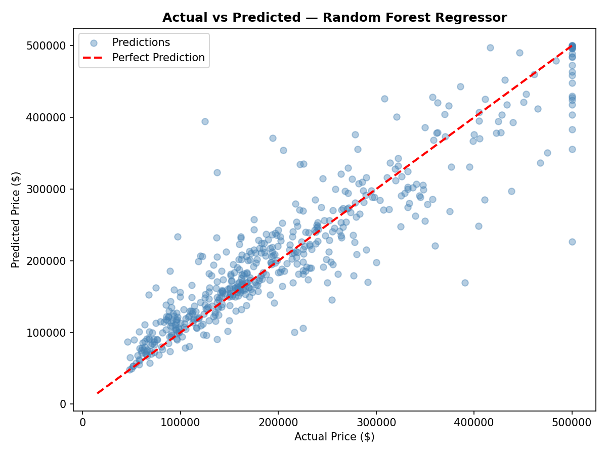
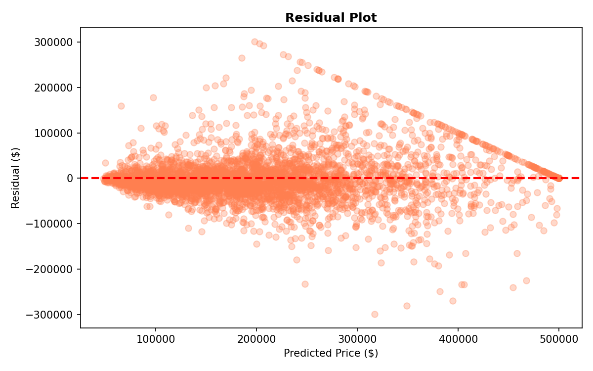
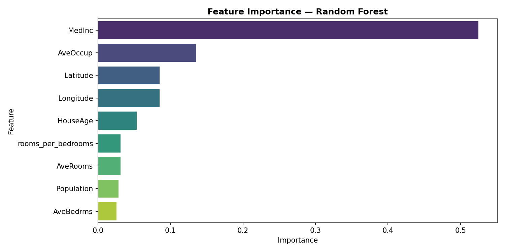
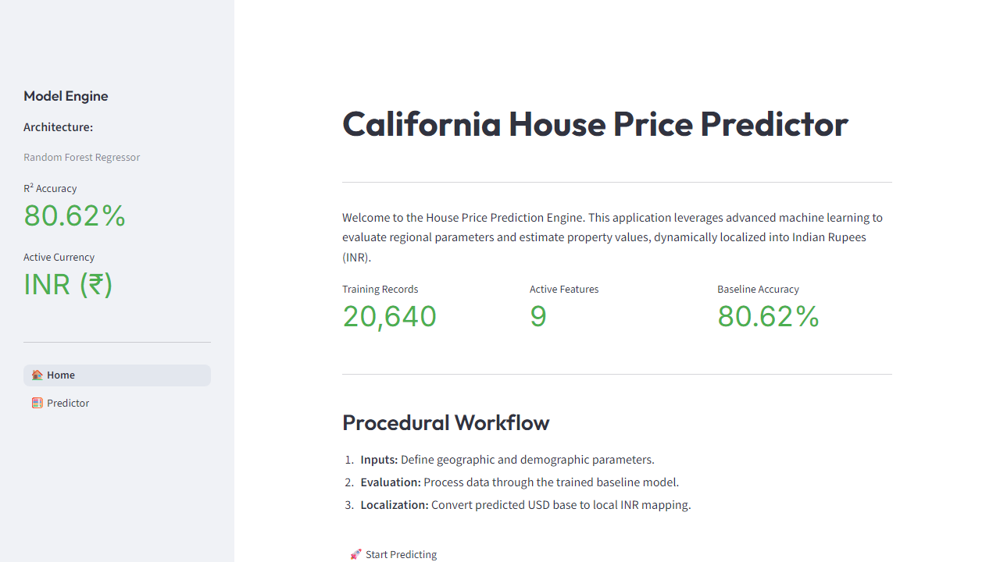
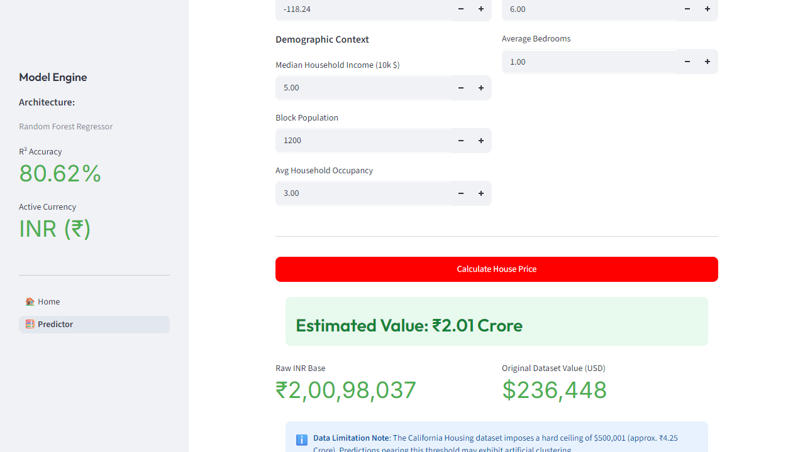

# Task 8 - House Price Prediction

**Synent Technologies Data Science Internship | SYN/M2/IP1050**

---

## Problem Statement

Predict California median house values based on demographic
and geographic features using supervised machine learning.
Compare Linear Regression (baseline) against Random Forest
Regressor and deploy the best model as a Streamlit web app.

*Disclaimer: INR values are shown for localization purposes only.
The underlying model was trained on the California Housing dataset.*

---

## Dataset

| Detail | Info |
|--------|------|
| Name | California Housing Dataset |
| Source | `sklearn.datasets.fetch_california_housing()` |
| Records | 20640 |
| Features | 8 original + 1 engineered |
| Target | MedHouseVal (unit = $100,000) |

Note: `MedHouseVal` is capped at $500,001 in the dataset.
This is a known limitation affecting upper-range residuals.

---

## Feature Engineering

Added `rooms_per_bedrooms = AveRooms / AveBedrms`
Captures housing spaciousness beyond raw room counts.

---

## Tools & Libraries

| Tool | Purpose |
|------|---------|
| Python 3 | Core language |
| Pandas | Data manipulation |
| NumPy | Numerical operations |
| Matplotlib / Seaborn | Visualizations |
| Scikit-learn | Preprocessing, models, evaluation |
| Joblib | Model serialization |
| Streamlit | Web app |

---

## Workflow

1. Load dataset via sklearn (no download needed)
2. Export raw CSV
3. Data quality check
4. Target distribution analysis
5. Feature engineering
6. Correlation analysis
7. Train/Test Split 80/20 (random_state=42)
8. Linear Regression with StandardScaler Pipeline (baseline)
9. Random Forest with GridSearchCV (n_estimators, max_depth)
10. Evaluation: MAE, RMSE, R²
11. Actual vs Predicted plot with identity line
12. Residual plot with interpretation
13. Feature importance chart
14. Save `model.pkl` + `model_info.json`
15. Export `predictions.csv`
16. Streamlit deployment

---

## Model Performance

| Model | MAE | RMSE | R² |
|-------|-----|------|----|
| Linear Regression | $52,885 | $72,803 | 0.5955 |
| Random Forest | $32,701 | $50,399 | 0.8062 |

Winner: **Random Forest Regressor**

Note: StandardScaler applied only to Linear Regression.
Random Forest is scale-invariant and does not require scaling.

---

## Key Insights

- **MedInc** is the top predictor.
- `rooms_per_bedrooms` engineered feature adds meaningful signal.
- Random Forest significantly outperforms Linear Regression.
- Dataset price cap at $500,001 causes residual clustering at upper price range — known dataset limitation.
- Model predicts within $32,701 on average (MAE).

---

## How to Run

```bash
# Step 1 — Install dependencies
pip install -r requirements.txt

# Step 2 — Run notebook to train and save model
# Open notebook/house_price_prediction.ipynb
# Run all 23 cells in order

# Step 3 — Launch app
cd app
streamlit run app.py

# Step 4 — Export PDF report
jupyter nbconvert --to pdf notebook/house_price_prediction.ipynb
# Rename output to Task8_Report.pdf and move to root folder
```

---

## Visualizations

### Actual vs Predicted Prices


### Model Residuals


### Feature Importance


### Streamlit App Interface (Home Page)


### Streamlit App Interface (Predictor Page)


---

## Repository Structure

```text
Task8-HousePricePrediction/
├── app/
│   ├── app.py
│   ├── utils.py
│   └── pages/
│       └── 1_Predictor.py
├── data/california_housing.csv
├── images/ 
│   ├── actual_vs_predicted.png
│   ├── correlation_heatmap.png
│   ├── feature_importance.png
│   ├── residual_plot.png
│   ├── screenshot_home.png
│   ├── screenshot_predictor.png
│   └── target_distribution.png
├── model/model.pkl
├── model/model_info.json
├── notebook/house_price_prediction.ipynb
├── outputs/predictions.csv
├── README.md
├── requirements.txt
├── Task8_Report.pdf
└── .gitignore
```

---

## Author

Hit Goyani  
B.Tech Information Technology | 4th Semester  
DEPSTAR, CHARUSAT University, Gujarat, India  
Data Science Intern — Synent Technologies  
Candidate ID: SYN/M2/IP1050
